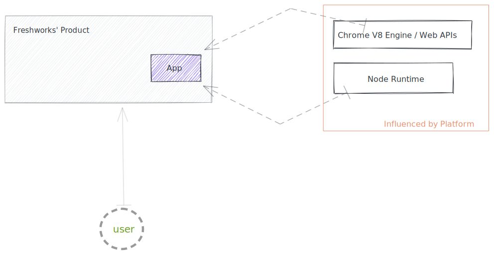
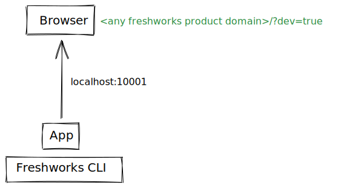

## Chapter 1: What is Freshworks Developer Platform

To solve those unique problems of extending/customizing a Freshworks' product, developer platform gives developer all the facilities to solve those problems by building web applications for those businesses.

Imagine you want to build a todo web app. Although there are many ways, one simplest approach would be

1. Write HTML and CSS that has a form and takes in task description.
2. A server running with APIs exposed to web.
3. Client sending the 'tasks' data to server by making API calls.
4. Server would have a database up and running to create a record

That not only means web app doesn't just require code to have it up and running.

It requires

1. Code editor (or tools like bundlers if frameworks) to write and organise code.
2. A Cloud Infrastructure provider like digital ocean to host server side code.
3. A way to manage databases.

But with Freshworks App Platform, to build the same app will not require you have your own servers or manage databases yourself. Developers would simply have to write code and upload a zip file and Freshworks takes care of the rest.

We will dive further into use-case driven approach when we survey Freshworks Apps. But for now, let's try and understand what encompasses Freshworks Developer Platform. It's the tools, infrastructure, APIs and SDKs.

### Infrastructure

If Freshworks App has to play in production, platform take app's source code zip file to manage and host it. Developer like you would get facilities to see the logs and publish the app. Once it becomes live, frontend components run in Browser JS runtime, UI renders in an iframe (from different origin) and backend components have access to serverless Node runtime.

[Edit it on Excalidraw](https://excalidraw.com/#json=4705880566136832,AtyL2E71ucIRDOxkwnmHcQ)

What else?

1. App can listen to a event inside of Freshworks' product and run your app logic.
2. App can run cron jobs
3. App can have a webhook generated and registered.
4. App can render UI and leverage most of Web APIs. We have Libraries to help you accomplish that. Also, in multiple placeholders.
5. App can securely manage API Keys - like sensitive information.
6. App would have access to complete serverless node environment to leverage NPM packages.
7. App can persist key value pairs across sessions and can be accessed both client side and serverside.
8. App can perform OAuth 2.0
9. App can have access information that user is currently surfing the Freshworks' product.
10. and so on.

All this comes accessible to app without any servers or services set up and kept running. Developer can leverage these facilities witht he help of App SDK.

### Application Programming Interfaces(APIs)

Every Interface that is provided to a developers to be consumed by thier program is an API. If the goal is to make level of abstraction is a lot higer with more intuitive interfaces Software Development Kits come great tools for a developer.

Likewise, Freshworks has APIs for developers in one or other varient.

**REST APIs**

REST endpoints are URLs those are exposed to the internet and are ready to serve any client. Freshworks' products like Freshworks CRM, Freshdesk, Freshservice, Freshchat, Freshcaller and Freshteam; all of them have own REST APIs.

**Freshdesk** **Widget SDK**

Businesses running their own sites have [help widget](https://freshdesk.com/customer-engagement/help-widget) to engage with website visitors. Often, Businesses want to customize, capture data, and have it seamless work with other software they might be using. To solve problems related to them, developers have facility to consume Widget APIs.

**Freshchat Web SDK**

Freshchat is product that helps business to chat with their customers.

Often, Businesses set it up on their websites as a chat widget to engage with website visitors. This SDK can be consumed by developers for their website to let it seamless talk to Freshchat.

**CRM Web SDK**

One of the features that CRM enables businesses is to understand the behaviour of the visitors on their websites. Upon including this SDK into website it sends visitor information to CRM.

**Freshworks App SDK**

Apps can play either in foreground or background with Freshworks' products as we've discussed. It ships by default with Freshworks CLI (called 'fdk' at times). This CLI runs on your local computer and simulates the [infrastructure]() that will help you run a Freshworks App locally and confidently before you can ship it to customers.

[Edit it on Excalidraw](https://excalidraw.com/#json=5224315666563072,eAdDE8QOYgxIvqQI_yhGvA) ⏫
