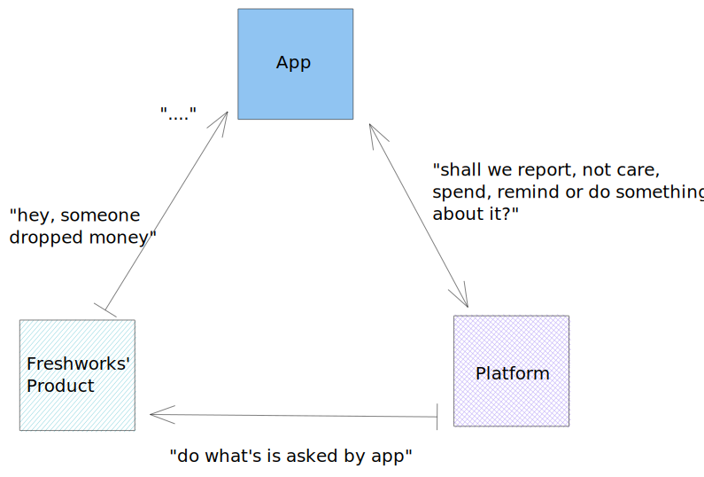

## Chapter 3: Digging into App Platform

The intent of this chapter is to give the you an mental model of an Freshworks App and how that plays on the app Platform. Before you can move forward, it is recommended that you have explored and tried out building any simple app from the documentation. While you are at it, this part of the guide requires you to be read alongside any App SDK documentation of Freshworks Product.

There are 3 main components that you'd need to keep in perspective while trying ot understand Freshworks App Platform.

1. Client-side
2. Configuration
3. Serverless

An ideal Freshworks App directory

```bash
├── app
│   ├── index.html
│   ├── scripts
│   │   └── app.js
│   └── styles
│       ├── images
│       │   ├── icon.svg
│       │   └── rocket.svg
│       └── style.css
├── config
|   |-- oauth_config.json
|   |-- assets/iparams.js
│   └── iparams.json / iparams.html
├── manifest.json
├── server
    └── server.js
```

### Client Side Components

App renders in an `<iframe>` . The frontend files such as HTML, CSS and JS files will run by Browser and UI of the app is rendered.

**app{}**

The Freshworks product is a single page SaaS application. Depending on the placeholders where the app chooses to be rendered UI components in the foreground or just JS in background, platform gives control to you.

1. As soon as user hits Freshworks product portal URL for the first time, platform sends app's clientside components like HTML,CSS and JS to the browser.
2. The Javascript thread of execution will weave in the order you mention `<script>` and `<link>` css.
3. If app's Javascript has
    1. `app.initialized()` - It returns a promise where you can pass an callback function. It happens first time when Freshworks product loads.
    2. `app.activated()` and `app.deactivated()` are similar accepts a callback function as argument, but they are invoked based on app placeholder.

**client{}**

Just like your JS scope has access to `app`, `app.initialized()` returns a promise to which your callback function will have access to an `client` object. This allows your app to be able to invoke any platform features mentioned in the Infrastructure.

1. `client.data.get("<argument>")` - returns a promise where your callback would have access data in the page which user is currently viewing.
2. `client.events.on("<argument>", callback)` - takes in a callback which will be invoked when desired event occured.
3. `client.interface.trigger("<argument>", { "key": "value" })` - gives the app access to show a notficiation, modal, so on.
4. `client.db.METHOD("KEY", "VALUE"[,options])` - gives app the persist key value pairs.
5. `client.request.METHOD("URL", options)` - returns a promise resolves with a callback which gives access to response payload in the callback's scope. This how your app can make API calls from the client side.
6. `client.instance.METHOD()` - returns a promise where you can pass callback or it simply invokes a method. Either case, whenever you have mulitple placeholders used by the same app, you can pass the contextual data from one placeholder to another maintaining it's state.

**OAuth**

If app needs talk to 3rd party, you'll need to add `oauth_config.json` file with all the necessary information. This will leave the app user to perform OAuth2.0 handshake first and then use the app. Platform would handle all the token management on behalf of you.

### Configuration Page

Like every app, Freshworks app would also need a 'settings' page which is supposed to be a page where users can configure some settings for the app. Often, it is described a 'Installation Page'.

For example, an app might need an API key to request information. It can be provided by the user during the app installation. Freshworks Platform can securely store it and provide it to the app for any API calls as needed.

There are two ways how you might want to build the UI of this page.

1. `iparams.json` - write a file in json format and expect the UI or form to be automatically created
2. or `iparams.html` - write HTML, CSS and JS yourself if that is more usable.

**iparams.json**

Create an text field just by adding,

```json
{
"installation_parameter": {
    "display_name": "Contact Details",
    "description": "Please enter the contact details",
    "type": "text",
    "required": true
  }
}
```

Likewise, add more and more attributes as needed for email, number, phone_number date, url, checkbox so on. I am sure, documentation is the right place where you'd understand this in depth.

**iparams.html**

Unlike JSON file that automatically renders the UI, you can actually right write a `html` , `<link>` `css` or even include `<scripts>`. With more flexibility given, platform gives developer the responsibility to handle the user entered information to pipe data to App platform by using specific labelled functions.

- `function postConfigs(){..}` - will take the data and pass to the App platform.
- `function getConfigs(){..}` - this method is invoked when user opens app settings page so that app wants to populate back configured settings(iparams).
- `function validate(){..}` - Logic to validate a certain field. For example, user enters a API Key, but is it valid? App can make a API call at this step and find that out.
- `client.iparams.get()` or `client.iparams.get(<installation_parameter>)` will return a promise. Developer can pass a callback that will have access to user information that is stored during installation. But this is available for client side javascript.

### Serverless

Web apps by nature would need a web server to be up and running. While that is still the truth, 'serverless' is a term that is used to describe developers not having to worry about making sure server is healthy all the time.

Freshworks apps are serverless facility by nature. This means all you'd need to do is to write code and focus on business logic. All apps by default get access to Node environment so that developers can begin to use NPM packages.

Just mention the package in `manifest.json` :

```json
{
  "platform-version": "2.0",
  "product": {
    "freshdesk": {
      "location": {
        "ticket_sidebar": {
          "url": "index.html",
          "icon": "styles/images/icon.svg"
        },
        "ticket_conversation_editor": {
          "url": "views/background.html",
          "icon": "styles/images/icon.svg"
        }
      }
    }
  },
  **"dependencies": {
    "superagent": "6.1.0"
  }**
}
```

and `require('npm_package')` it in `.js` files in `server/` directory.

Node.js developers would find this really helpful as they get access endless packages on NPM repository. But that doesn't stop there, app platform can facilitate more serverless way. App platform depicts it by calling 'Events'. These are different from Browser events. These are functions those get invoked when desired event happens in node.js environment.



[Edit it on excalidraw](https://excalidraw.com/#json=5447988973404160,lbuZyqYOptgEwjwOvQdGmg) 🆙

```jsx
// server.js

exports = {
  events: [
    { event: "onTicketCreate", callback: "onTicketCreateCallback" }
  ],
  onTicketCreateCallback: function(payload) {
    console.log("Logging arguments from onTicketCreate event: " + JSON.stringify(payload));
  }
}
```

- **Product Events** are hooks given by Freshworks product'. Freshdesk as helpdesk software would give you `onTicketCreate`, `onTicketUpdate` so on. Likewise, Freshworks CRM would tell the app `onContactCreate` like wise. You will find this detailed out in the documentation.
- **App Setup Events** are something that app can get aware of when it gets installed or uninstalled.
- **External Events** generates a webhook which you gave give that to any 3rd party application. Now app can invoke a callback that is defined whenever 3rd party application wishes to.
- **Scheduled Events** would register and run callbacks as a cron job. Like regular back up of data and so on.
- **Server Method Invocation** is special. Because, Client side javascript can invoke a serverless function with simple `client.request.invoke()` . It  invokes the function and returns the result to the callback as an argument.
- **Request and Data Storage** is also possible to be used in server side by invoking `$db.set(<key>,<value>)` and `$request.METHOD("URL", options)` function calls. Both of them would let you define callbacks and author's code will have access to data required in form of arguments sent to these callbacks.

All the the Serverless Events, will let author define a callback and app platform sends payload as arguments to these callback. You can consume these payloads to perform the logic and solve the use case.

### Local development

No developer builds an app in production. At least as far as I know.

There has to be a way for Freshworks App developers can develop apps on own local computers. So we built Freshworks CLI that will serve your app and simulate all Client side, Configuration and Serverless components. Each of these components may vary in how you simulate them.

See Testing section if there's any. It would describe you how you can locally simulate and develop your app.

However, this is not a tutorial. All the resources that you may need, I will add them in [Appendix B](./apB.md).
